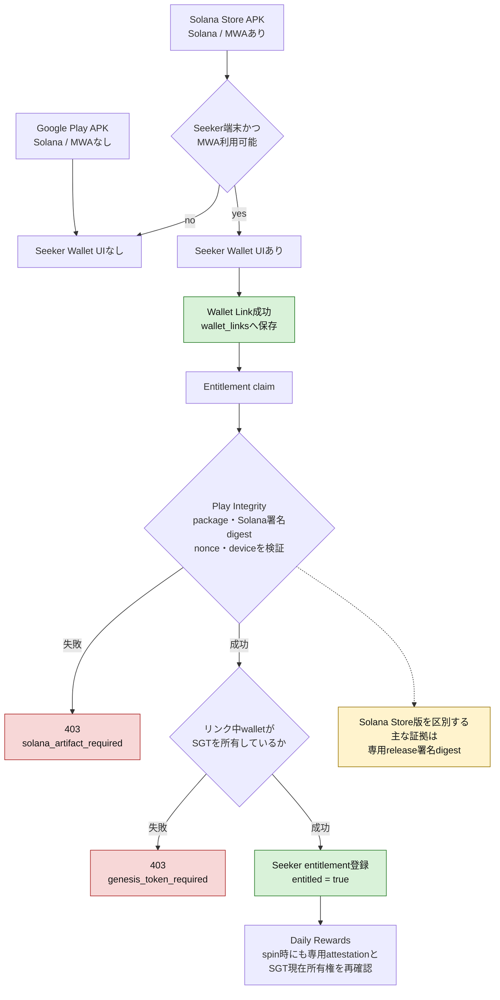

## Blocking

## 1. **Seeker entitlement is not restricted to the Solana Store Android build.**

**実装方針（採用）:** 今回のPRの範囲を広げずに指摘を解消するため、短寿命capabilityや既存ウォレットAPI全体の変更は追加せず、Seeker EntitlementのclaimとDaily RewardsのspinだけにSolana版専用attestationを必須化します。

既存の汎用`verifyNativeAttestationChallenge()`をそのままSeeker認可に使わず、Android専用の`verifySeekerSolanaArtifactAttestation()`を追加します。このverifierは次の条件を全て必須にします。

- `platform === 'android'`
- Solana版専用package名と一致
- Solana版専用署名証明書digestと一致
- Solana署名証明書allowlistが未設定ならfail closed
- Play版packageまたはPlay版署名を拒否
- iOS DeviceCheckを拒否
- サーバーnonceと用途別actionが一致
- 必要なdevice integrity verdictを満たす

証明書digestやflavorをクライアントの自己申告から受け取るのではなく、サーバーがGoogleのデコード済みIntegrity token内のpackage名と証明書digestを検証します。認証境界は「Solana Storeからインストールされたこと」ではなく「正規のSolana版署名artifactであること」とし、正規Solana APKのsideloadも同じartifactとして許可する既知のポリシーにします。

`POST /api/seeker/entitlement`では`seeker-claim` actionの専用proofを要求します。ウォレットとSGTを所有していても、iOS、Google Play署名Android、proofなし、設定不備の場合は`seeker.solana_artifact_required`の安定した403で拒否します。

さらに、Solana版で一度Entitlementを取得した同一アカウントをiOS版やPlay版で利用しても報酬を受け取れないよう、`POST /api/daily-rewards/spin`にも新しい`seeker-spin` actionの専用proofを要求します。spinは1日1回なので、毎回新しいattestationを取得する方式でも負荷は限定的です。サーバー側のspin条件は、通常のアカウント認証、保存済みSeeker Entitlement、claim済みSGTの現在所有権、有効な`seeker-spin`用Solana artifact attestationの全てとします。`seeker-claim` proofのspinへの再利用もaction不一致で拒否します。

一般のWebウォレット、Wallet Standard/Reown、既存のwallet link/status/unlink APIは今回変更しません。Play APKからSolana/MWAコードを除外してUIを非表示にする対応はストア規約と防御層として行いますが、サーバー認可は上記2つのSeeker専用routeで保証します。

最低限、次の正負テストを追加します。

- Solana署名Androidと正しいnonce/actionでclaim成功
- Google Play署名Android、iOS、proofなしでclaim拒否
- Solana署名Androidと正しいproofでspin成功
- Google Play署名Android、iOS、proofなしでspin拒否
- `seeker-claim` proofをspinへ再利用すると拒否
- Solana署名allowlist未設定時は本番環境でfail closed
- EntitlementとSGT所有権があってもSolana proofなしではspin拒否

**実装結果（レビュアー返信用）:**

Implemented a purpose-specific Solana Store artifact verifier for the two
Seeker-authorized operations. `verifySeekerSolanaArtifactAttestation()` accepts
Android proofs only and validates the server-issued nonce, the exact
`seeker-claim` or `seeker-spin` action, the configured package name, an explicit
Solana Store release-certificate allowlist, and the required device-integrity
verdict against Google's decoded Play Integrity payload. iOS DeviceCheck
proofs, Google Play-signed artifacts, missing proofs, mismatched actions, and
missing package or certificate configuration fail closed.

`POST /api/seeker/entitlement` now requires a fresh `seeker-claim` proof.
`POST /api/daily-rewards/spin` independently requires a fresh `seeker-spin`
proof on every native spin, in addition to the existing account authentication,
stored Seeker entitlement, and current claimed-SGT ownership checks. A claim
proof cannot be reused for a spin because the server consumes each challenge
and verifies its purpose. The existing general wallet link, status, unlink,
Wallet Standard, and Reown routes were not changed.

The client now requests the matching purpose-specific proof before claim and
spin requests. Rejections use the stable
`seeker.solana_artifact_required` code, with client-side localization and the
required non-Latin locale fills. Focused tests were added for the valid Solana
artifact path and for iOS, Play signing certificate, missing allowlist,
missing or invalid proof, action mismatch, and claim/spin route enforcement.
These tests have been added but have not yet been run, because verification is
being deferred until all review items are implemented.

**Release configuration注意点:**

- `SEEKER_SOLANA_INTEGRITY_PACKAGE_NAME` must be set to the package name
  contained in the Solana Store artifact.
- `SEEKER_SOLANA_INTEGRITY_CERT_DIGESTS` must contain only the SHA-256
  certificate digest or digests used to sign the Solana Store release artifact.
  It must not include the Google Play app-signing certificate.
- `SEEKER_SOLANA_INTEGRITY_DEVICE_VERDICT` defaults to
  `MEETS_DEVICE_INTEGRITY`.
- Missing package or certificate configuration intentionally disables Seeker
  claim and native spin authorization by failing closed.
- The boundary proves that the request came from the allowlisted signed
  artifact. It does not attempt to prove the APK's installation source, so a
  legitimately signed Solana Store APK remains valid when sideloaded.
- Before release, verify the exact base64url SHA-256 certificate digest from a
  decoded production verdict. A hexadecimal certificate fingerprint must not be
  copied into the allowlist without converting it to the format returned by
  Play Integrity.

**Solana Store / Google Play判定とSeeker認可の全体図:**

判定材料の責務は次のように分離します。

- Gradle flavor、`BuildConfig.SOLANA_MOBILE_DISTRIBUTION`、Seeker model判定、
  MWA plugin有無は、APK内容とクライアントUIを分けるための材料です。これらは
  クライアントから偽装できる前提で、サーバー認可には使用しません。
- Wallet Linkのmessage署名は、ユーザーがそのwalletを操作できることだけを証明します。
  SGT所有、APK flavor、インストール元は証明しません。
- Play IntegrityのGoogle署名payload、サーバー発行nonce/action、package名、
  device verdict、Solana Store専用release証明書digestが、Seeker routeの
  サーバー側artifact境界です。
- SGT所有権はartifact検証通過後に、サーバー側のbounded read-only Solana JSON-RPCで
  独立して確認します。
- `seeker_entitlement_claims`は、artifact検証とSGT所有確認の両方を通過した場合だけ
  作成します。Wallet Link成功だけではSeeker entitlementを付与しません。
- Play IntegrityはSolana dApp Storeのインストール元を証明しません。今回の境界は
  allowlistされた署名artifactを証明するものであり、同一署名APKのsideloadも許可します。
- Google Play版とSolana Store版で同じDebug証明書を使うローカルビルドでは、署名による
  最終的な配布物の区別はできません。本番確認では別々のrelease署名証明書が必要です。

**ローカル検証の制約（PR記載用）:**

A live entitlement registration was observed on the Solana Store debug build:
after the local entitlement row was removed, connecting the SGT wallet
recreated the `seeker_entitlement_claims` data, and subsequent status reads
returned `entitled: true`. This confirms the entitlement registration path, but
does not yet prove the previously-linked-wallet fix by itself because the
entitlement may have been recreated during the explicit wallet connection
before logout. A separate manual check without reconnecting or relinking the
wallet is still pending. The claim POST was not retained in the inspected
DevTools Network history. The source of the server's Google service-account
configuration was not inspected or disclosed.

A successful Daily Rewards spin could not be exercised locally because the
current environment does not provide the price-fetching path required to
satisfy the spin preconditions. This is recorded as an environment limitation,
not as a successful manual spin verification.

**Pre-release verification boundary:**

Before the signed Solana Store artifact is available, manual verification is
limited to the fail-closed paths. The Google Play APK must receive a 403 from
the Seeker entitlement claim route, and Web and iOS clients must also remain
ineligible. A linked wallet or SGT ownership alone must not create entitlement
or expose the server-side Daily Rewards functionality.

The successful POST claim path is covered without Play Integrity credentials
by focused RouteDef tests that inject a successful artifact verifier and mock
the bounded Solana RPC response. These tests exercise the normal wallet lookup,
deterministic SGT selection, permanent claim, status response, single-flight,
queue capacity, and deadline behavior. This dependency injection exists only
inside the test process. No environment variable, request header, APK flag, or
production-server bypass accepts a claim without the real artifact proof.

The production allowlist must not include a Solana Store release-certificate
digest until the final distribution artifact and its signing configuration are
available. Therefore the server implementation may be deployed before the
Solana Store APK without opening the reward path: an artifact that cannot
satisfy the package, certificate, nonce, action, and device-verdict checks
fails closed.

Before Solana Store publication, the release-signed artifact will be verified
in staging with the configured Play Integrity service account. The successful
claim and entitlement restoration will be exercised there, together with
negative checks for the Google Play APK, iOS, Web, an unapproved certificate,
an invalid or replayed nonce, an unacceptable device verdict, and a wallet
without the selected SGT. A legitimately signed Solana Store APK may be
sideloaded for this test because the authorization boundary identifies the
allowlisted signed artifact, not its installation source.

## 2. **One release-policy question also remains: the Play APK still packages the Solana/MWA dependencies via unqualified `implementation` entries and registers the plugin, although runtime methods reject it. If non-Solana store policy requires crypto code to be absent rather than merely disabled, this is an additional blocker.**

**実装方針（採用）:** AndroidのSolana/MWA依存を`implementation`から`solanaStoreImplementation`へ移します。実際のMWAプラグイン、Solana SDK型を参照するコード、Capacitorへの登録処理は`android/app/src/solanaStore`へ移し、`android/app/src/main`にはSolana SDKへ依存しない小さなinterfaceと共通処理だけを残します。`android/app/src/play`には同じinterfaceを満たして常にunsupportedを返すWeb3非依存実装を配置します。共有`MainActivity`と共有manifestから実プラグインクラスへの直接参照を除去し、各variant側の登録処理だけが対応する実装を参照する構造にします。

PlayとSolana StoreのDebug variantをそれぞれコンパイルし、Play variantのresolved dependency graph、最終DEX/class一覧、merged manifest、Capacitor plugin登録を検査するテストを追加します。Play APKにSolana/MWA artifact、対象package、実プラグイン登録のいずれかが含まれた場合は失敗させます。Solana Store variantについては逆に実依存とプラグイン登録が存在することを固定します。この物理分離と、Blocking 1のサーバー側artifact認証を独立した防御層として両方実装します。

**実装結果（レビュアー返信用）:**

Implemented physical Android variant isolation for the Solana Mobile stack.
The MWA client, Solana Web3, RPC, and supporting encoding dependencies now use
`solanaStoreImplementation` instead of unqualified `implementation`, so they
are not part of the Play variant runtime classpath.

`NativeSolanaMobilePlugin` was moved out of the shared `src/main` source set
and into `src/solanaStore`. The shared Activity behavior now lives in
`BaseMainActivity`, which still registers the existing native-attestation and
app-update plugins in their original order. Each distribution supplies its own
small `MainActivity`:

- the Play Activity performs no distribution-specific plugin registration and
  contains no reference to the Solana plugin or SDK;
- the Solana Store Activity registers `NativeSolanaMobilePlugin`;
- the shared manifest continues to reference `.MainActivity`, and Gradle
  selects exactly one flavor-specific implementation for each APK.

This preserves the original Play Activity behavior while preventing the Play
Java and Kotlin compilation units from resolving the real MWA plugin class.
The client already fails closed when the native plugin is absent, so the Play
build reports no Solana Mobile capability and does not expose the Seeker wallet
flow. The server-side signed-artifact authorization from Blocking item 1
remains an independent enforcement layer.

The Android distribution contract test was updated to pin all Solana-related
coordinates to `solanaStoreImplementation`, verify that the real plugin exists
only under `src/solanaStore`, verify that only the Solana Store Activity
registers it, and recursively reject Solana SDK or plugin references anywhere
under the shared or Play Java and Kotlin source sets. The test has been added
but has not yet been run because verification is being deferred until all
review items are implemented.

**最終検証時の注意点:**

- Compile both `playDebug` and `solanaStoreDebug`. Source-level isolation alone
  does not replace compilation of both variants.
- Inspect `playDebugRuntimeClasspath` and confirm that no
  `com.solanamobile` or `io.github.funkatronics` artifact is resolved.
- Inspect the final Play APK DEX or class inventory and confirm that
  `NativeSolanaMobilePlugin` and Solana/MWA classes are absent.
- Inspect the Play merged manifest and Capacitor plugin registration output to
  confirm that the native Solana plugin is not registered.
- Perform the inverse checks on the Solana Store APK: its runtime classpath and
  final class inventory must contain the required MWA implementation, and its
  flavor-specific Activity must register the plugin.
- The two flavor-specific `MainActivity` classes are mutually exclusive. They
  are never packaged together; both inherit the unchanged common registration
  of `NativeAttestationPlugin` and `NativeAppUpdatePlugin`.

**Manual verification completed:**

- Gradle dependency inspection of `playDebugRuntimeClasspath` returned no
  `com.solanamobile` or `com.funkatronics` matches.
- The inverse inspection of `solanaStoreDebugRuntimeClasspath` resolved the
  expected Solana Mobile dependencies, confirming that the dependency split is
  variant-specific rather than a missing dependency installation.
- The generated `app-play-debug.apk` was inspected across every contained DEX
  file with the Android SDK `dexdump` tool. Positive controls including
  `MainActivity`, `BaseMainActivity`, and the shared native plugins were
  present, while `NativeSolanaMobilePlugin`, `com.solanamobile`, and
  `com.funkatronics` produced no matches.
- On an installed `playDebug` build, the wallet and Seeker controls were not
  displayed. Runtime inspection also returned `false` from
  `window.Capacitor?.isPluginAvailable?.("NativeSolanaMobile")`.

These checks confirm both build-time exclusion and runtime unavailability in
the Play debug artifact. The equivalent release-artifact inventory must still
be repeated against the final signed Play APK before publication. Successful
Solana entitlement authorization remains a separate pre-publication staging
check that requires the final Solana Store certificate allowlist and Play
Integrity service configuration.

## 3. **Previously linked wallets never acquire Seeker entitlement.**

**実装方針（採用）:** リンク済みウォレットのEntitlement同期を`src/main.ts`へ直接追加せず、API、artifact capability、attestation生成を注入できる小さな`src/net`モジュールへ分離します。`refreshWalletLinkStatus()`がリンク済みpubkeyを確定した後、Solana Store版Seekerの場合だけこの同期処理を呼びます。同期処理は最初に`GET /api/seeker/entitlement`を実行し、取得済みなら終了し、未取得の場合だけ新しい`seeker-claim` attestationを生成して`POST /api/seeker/entitlement`を実行します。

同じアカウント・pubkeyに対する処理は共有Promiseでsingle-flight化します。一時的なネットワーク、RPC、5xx失敗では既存ウォレットリンクを解除せず、次回の状態refreshで再試行できるようにします。SGTなし、別アカウントでclaim済み、Solana artifact不一致などの恒久的な拒否は同一セッション中に自動連打せず、安定したエラーコードをUIへ再ローカライズします。取得済み、未取得、ウォレットなし、非Solana variant、同時refresh、一時失敗後の再試行をfocused testsで固定します。

**実装結果（レビュアー返信用）:**

Implemented entitlement synchronization for wallets that were linked before
the current app session. After `refreshWalletLinkStatus()` successfully
restores the server-linked wallet, the client now invokes a dedicated
`src/net/seeker_entitlement_sync.ts` coordinator. The coordinator is called
only when the native capability check has positively identified an enabled
Solana Store Seeker environment and an authenticated account has a linked
wallet.

The coordinator first reads `GET /api/seeker/entitlement`. If entitlement
already exists, it completes without creating an attestation. If entitlement
is missing, it creates a fresh `seeker-claim` proof and submits
`POST /api/seeker/entitlement`. This means an existing linked wallet can acquire
Seeker entitlement after app restart or after a previously interrupted claim,
without requiring the user to unlink and relink the wallet.

Concurrent refreshes for the same account and wallet share one Promise, so
they produce only one status and claim sequence. Network failures, missing
native proofs, HTTP 429 responses, and 5xx responses are treated as transient:
the existing wallet link is preserved and a later status refresh can retry.
Ordinary 4xx claim rejections are treated as permanent for the current client
session, preventing an automatic retry loop. Their stable server code is
rendered through the existing `userFacingApiError()` localization boundary.
Logging out or leaving the eligible native capability resets the per-session
rejection state. A generation guard prevents an older in-flight request from
repopulating that state after reset.

The existing fresh-link flow remains intact and still performs its immediate
claim. The new module specifically closes the restore and retry gap without
changing the general wallet link, status, unlink, Wallet Standard, or Reown
contracts.

Focused tests were added for an already-entitled account, a missing entitlement
followed by claim, no linked wallet, a non-eligible build, concurrent refresh
single-flight behavior, transient retry, missing-proof retry, permanent
rejection suppression, session reset, and the production
`refreshWalletLinkStatus()` integration point. These tests have been added but
have not yet been run because verification is being deferred until all review
items are implemented.

**実機確認時の注意点:**

- Test with an account that has a server-linked SGT wallet but no stored Seeker
  entitlement. Restarting the Solana Store app should claim entitlement without
  unlinking or signing the wallet-link message again.
- Confirm that an account with existing entitlement performs only the status
  read and does not open a new attestation prompt.
- Simulate a temporary network or attestation failure, confirm that the linked
  wallet remains displayed, then refresh or restart and confirm that the claim
  can succeed.
- Confirm that a permanent rejection is localized and is not repeatedly
  submitted during the same session.
- The server configuration and Solana Store signing-certificate allowlist from
  Blocking item 1 must be present; otherwise the automatic claim correctly
  fails closed with `seeker.solana_artifact_required`.

## Should fix

## 1. **The promoted rewards chest overlaps the actionable target frame.** 
UIの問題なのでCSS等をDebug中に充てて最適なものを見つけます

**実装方針（採用）:** `src/styles/hud.mobile.css`のSeeker Daily Rewards配置を調整し、portraitとcompact landscapeの両方で宝箱用の2段目を専用領域として予約し、ターゲットフレームとパーティフレームをその下へ配置します。`z-index`や`pointer-events`だけで隠すのではなく、40x40px以上のタッチターゲットを維持したまま実際の矩形を分離します。既存の一般モバイル配置は変更せず、Seeker有効時のselectorだけに限定します。

ソース上のCSS値を固定する契約テストに加えて、実ブラウザで両orientationの`getBoundingClientRect()`が交差しないこと、ターゲット上の`elementFromPoint()`が宝箱を返さないことを検証するrendered layout testを追加します。実機でもportrait、compact landscape、DevToolsのtouch emulationで操作競合がないことを確認します。

**実装結果（レビュアー返信用）:**

The promoted Seeker Daily Rewards chest keeps its existing second-row shortcut
and its 58x54 touch target. The Seeker-only mobile layout now reserves that
complete row before positioning the target and party frames. Separate portrait
and compact-landscape offsets account for the maximum 1.3 Action Button Size
setting and leave at least 8px between the scaled chest target and the
actionable unit frames.

The adjustment is scoped to `body.mobile-touch.seeker-wallet-enabled`.
Non-Seeker mobile layouts, the standard More-tray rewards action, and desktop
Daily Rewards are unchanged. The fix changes real geometry rather than relying
on stacking order or `pointer-events`, so the chest cannot intercept a target
frame touch through overlap.

The existing Android Seeker source-contract test now pins the portrait and
landscape target and party reservations. A focused browser-mode regression test
mounts the real stylesheet at portrait and compact-landscape viewports with the
maximum button scale, checks that the chest and target rectangles do not
intersect, confirms the chest remains at least 40x40, and verifies
`elementFromPoint()` over the target resolves to the target rather than the
chest.

Verification completed:

- `npx vitest run tests/android_seeker_distribution.test.ts
  tests/css_corpus.test.ts tests/css_value_validity.test.ts`: 35 tests passed
- `npx tsc --noEmit`: passed
- `git diff --check`: passed

The browser-mode regression was added but could not be executed in the current
environment because the Playwright Chromium binary is not installed. Final
portrait and compact-landscape visual confirmation on a physical device also
remains pending.

## 2. **Multi-SGT wallets are reduced to an arbitrary first token.** 

**実装方針（採用）:** 初回claim時に所有中のSGT mintを全件収集し、base58表現の昇順などRPCの返却順序に依存しない決定的な規則で1つだけ選択します。選択したmintは既存の一意制約とトランザクションを使ってaccountへ永久に紐付け、同じmintを別accountがclaimできないこと、および同じaccountの再試行で別mintへ切り替わらないことを保証します。今回のPRではclaim前の選択UIは追加しません。

claim成功レスポンスと`GET /api/seeker/entitlement`のstatusレスポンスへ`claimedMint`を追加します。未取得の場合は`null`またはフィールドなしのどちらかにAPI契約を統一し、完全なmint文字列を返します。クライアントは通常表示では先頭と末尾を残した短縮mintを使い、「Daily RewardsにはこのSGTを現在リンク中のウォレットに保持してください」というローカライズ済み案内を表示します。完全なmintをコピーできる操作と、許可されたSolana Explorer URLを生成して確認できる操作も提供し、両方をキーボード操作可能かつ40x40px以上のタッチターゲットにします。

Daily Rewardsの所有権確認では、新しく検出した「最初のSGT」ではなく、DBに保存された`claimedMint`だけを現在リンク中のウォレットが所有しているか確認します。RPCのアカウント返却順序が変わっても結果が変化しないようにします。保存済みmintを所有していない場合は、ウォレット内に別の未選択SGTが存在しても自動で付け替えず、`seeker.claimed_token_not_owned`の安定したエラーコードを返します。クライアントでは、表示中の選択済みmintをリンク中ウォレットへ戻すか、そのmintを保有するウォレットへリンクを変更するようローカライズして案内します。

focused testsでは、複数候補から常に同じmintが選択されること、claim再試行とRPC順序変更で保存済みmintが変わらないこと、claim/status APIが同じ`claimedMint`を返すこと、短縮表示・コピー・Explorer URLが正しいこと、選択済みmintだけを移動すると理由付きで失敗すること、そのmintを保有する別ウォレットへリンクを変更すると再び成功すること、別の未選択SGTへ自動で付け替わらないこと、同一mintの競合claimが一意制約により片方だけ成功することを固定します。

## 3. **Initial SGT verification has no RPC deadline or global concurrency bound.** 
**実装方針（採用）:** Seeker RPC呼び出しを専用のbounded executor経由に統一します。claimと現在所有権確認の両方で必須の`AbortSignal.timeout()`を生成し、`findSeekerGenesisToken`系の全RPCへ伝播させます。プロセス全体で共有するsemaphore、上限付き待機キュー、待機期限を追加し、同一アカウントの重複検証はsingle-flightで1本にまとめます。既存のRPCレスポンス件数・mint数・byte上限は維持します。

timeout、queue満杯、待機期限超過、upstreamエラーは全てEntitlementを付与しないfail-closed結果にし、内部理由をログへ、クライアントには安定した再試行可能エラーコードと適切なHTTP statusを返します。タイマーとpermitは成功・失敗・abortの全経路で必ず解放します。最大同時実行数を超えないこと、同一アカウントが1 flightになること、timeoutでhandlerが終了すること、permit leakがないことをfake clockとdeferred Promiseでテストします。

## 4. **The reusable MWA authorization token is stored in backup-eligible plaintext preferences.** 
**実装方針（採用）:** Solana Store variantにAndroid Keystore backedのauthorization token storeを追加します。Keystore内のnon-exportable AES-GCM鍵でtokenを暗号化し、暗号文、IV、versionだけを専用Preferencesへ保存します。既存の平文tokenは読み出して使用せず削除し、次回接続時にMWA authorizationをやり直す安全な移行にします。Play variantにはこのstoreもMWA token処理も含めません。

専用Preferencesを`data-extraction-rules`と`full-backup-content`の両方でcloud backup、device transferから明示的に除外します。復号失敗、認証tag不一致、鍵失効、鍵不在、アプリ再インストール時は保存値を削除して再authorizationへ戻し、token、暗号文、復号例外の秘密情報をログへ出しません。平文が保存されないこと、round trip、tamper時の破棄、鍵失効時の回復、backup除外、Play APKに実装が存在しないことをテストします。

**Implementation result (reviewer response):**

Implemented a Solana Store flavor-only `MwaAuthorizationTokenStore` using the
platform Android Keystore. The reusable MWA authorization token is encrypted
with a non-exportable AES-256 key using `AES/GCM/NoPadding`, a fresh
cipher-generated IV for every write, a 128-bit authentication tag, and stable
AAD binding the package, preferences file, key alias, and envelope version.
Only the version, IV, and authenticated ciphertext are stored. No credential
or cryptographic exception content is logged or returned through Capacitor.

Malformed envelopes, modified ciphertext or AAD, missing or unusable Keystore
keys, invalid UTF-8, oversized tokens, and encryption or commit failures fail
closed. The encrypted record, key alias, in-memory token, and cached wallet
address are cleared so the user must authorize again. Disconnect performs the
same credential cleanup.

The previous plaintext token is never read or migrated. Startup synchronously
removes it, and MWA remains disabled if deletion does not commit successfully.
Existing users therefore perform one new Seed Vault authorization after the
upgrade. Both `solana_mobile_auth.xml` and the historical plaintext-bearing
`solana_mobile.xml` are excluded from legacy full backup, Android 12+ cloud
backup, and device transfer through a Solana Store-only manifest overlay. The
Play variant contains neither the token-store implementation nor these
MWA-specific backup resources.

The MWA dependency's test-only transitive `androidx.test.ext:junit-ktx`
artifact is excluded from the Solana runtime classpath. No library, repository,
Gradle plugin, permission, network destination, signing behavior, or
transaction capability was added.

Verification completed:

- `tests/android_seeker_distribution.test.ts`: 11 tests passed.
- `:app:testSolanaStoreDebugUnitTest` passed.
- `:app:compilePlayDebugJavaWithJavac`,
  `:app:compileSolanaStoreDebugKotlin`, and
  `:app:compileSolanaStoreDebugAndroidTestKotlin` passed.
- The merged Solana manifest contains both backup-rule references, while the
  merged Play manifest contains neither Solana backup resource reference.
- TypeScript, repository-pinned Biome, and `git diff --check` passed.
- Focused security and release-malware reviews passed with zero attributable
  high-severity or unresolved findings.

The AndroidKeyStore instrumentation suite covers encrypted round-trip,
plaintext absence, fresh IV and ciphertext, tamper rejection, missing-key
recovery, malformed version, size bounds, and AAD record-swap rejection. It
compiled successfully, but the connected-device Gradle run timed out during
APK installation and produced no completed result. Running that suite on the
Seeker, followed by manual connect, restart, restored connection, disconnect,
and restart checks, remains the final device verification for this item.

## 5. **Seeker first-run defaults can overwrite explicit Browser Effects and Weather choices.** 
**実装方針（採用）:** `graphicsDefaultApplied`をBrowser EffectsとWeatherの判定に流用する処理を削除し、`src/game/seeker_first_run_settings.ts`で各設定を独立して扱います。Browser EffectsとWeatherのそれぞれにSeeker既定値適用済みマーカーを設け、各設定UIの変更処理ではユーザーが明示的に変更したことを個別に記録します。

Seeker初回処理は、対象設定の保存値が存在せず、ユーザー変更済みでもSeeker既定値適用済みでもない場合にだけ既定値を保存します。既に保存値がある既存ユーザーは、その値の由来を推測せずユーザー選択として尊重し、一切上書きしません。初回未設定、既存保存値、graphicsだけ適用済み、Browser Effectsだけ変更済み、Weatherだけ変更済み、2回目起動の各ケースをpure module testで固定します。
